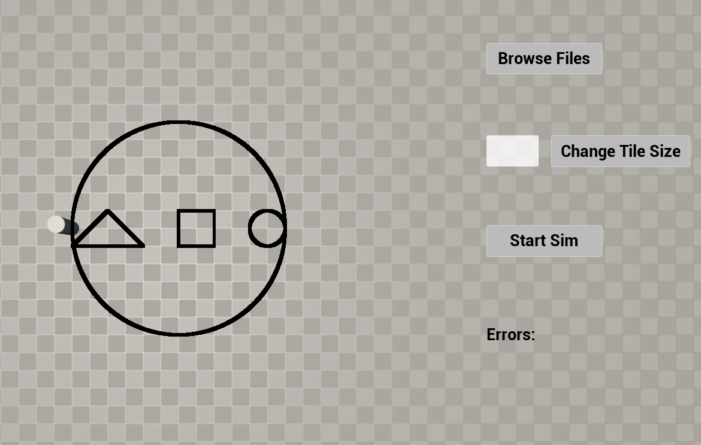

# Cutting Simulation Tool README

## Overview
This cutting simulation tool is programmed using Unreal Engine 5 (UE5). It takes input in the form of lines and arcs and converts them into G-code, which is a numerical control (NC) programming language used in computer-aided manufacturing (CAM) processes. The tool then simulates the cutting process using UE5.

## Input Format
The input format consists of lines and arcs specified by their coordinates and attributes.

Example Input:

LINE 100 100 1

LINE 200 0 1

LINE 0 0 1

LINE 300 0 0

LINE 400 0 1

LINE 400 100 1

LINE 300 100 1

LINE 300 0 1

LINE 500 50 0

ARC 600 50 550 50 1

ARC 500 50 550 50 1

LINE 0 50 0

ARC 600 50 300 50 0

ARC 0 50 300 50 0

## G-code Output
The input lines and arcs are processed and translated into G-code, which represents the toolpath for the cutting operation. The generated G-code is then saved into a file.

## Simulation
After generating the G-code, the cutting process is simulated within UE5. The toolpath is visualized, and the cutting action is simulated to provide a preview of the actual cutting process.

## Final Cut Preview

## Features
- **Change of Cutting Resolution:** You can adjust the cutting resolution according to your requirements.
- **Error Validation:** The tool performs validation on the input file to detect and handle errors gracefully.
- **Center Camera:** Press the 'F' key to center the camera.
- **Toggle Camera Movement/UI:** Press the 'V' key to toggle between camera movement and UI interaction.

## Testing
- **G-code Parser Tests:** The tool includes comprehensive tests for the G-code parser to ensure accurate translation of input data into G-code instructions.
- **Input Validation:** Thorough testing is implemented for input validation to identify and handle various edge cases and erroneous inputs effectively.

## Usage
1. Input your lines and arcs in the specified format.
2. Import the file to generate the G-code.
3. Run the simulation to visualize the cutting process and preview the final cut.

## Credits
- Developed by Cristian Budin
